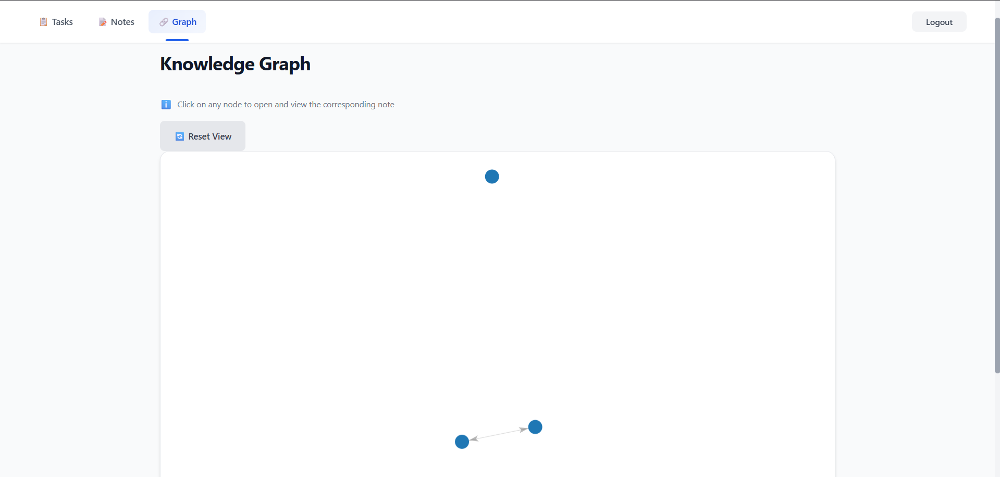
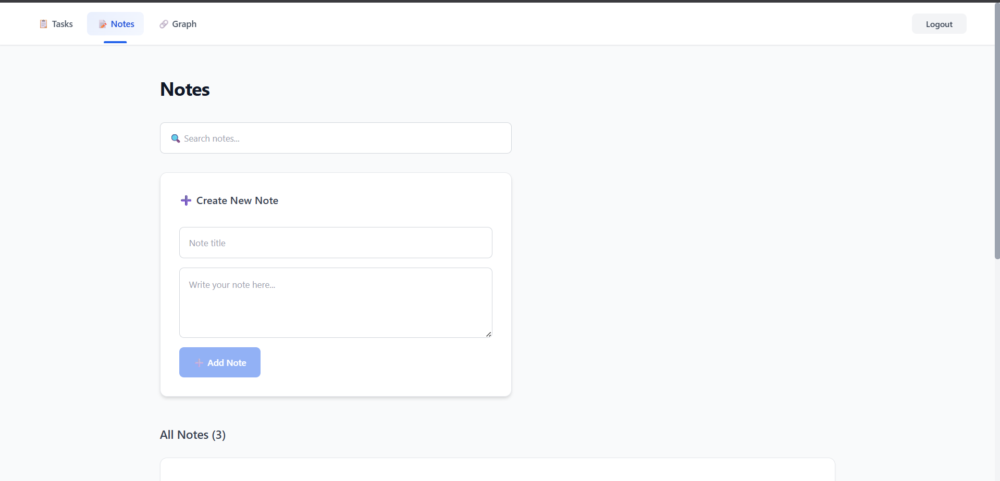
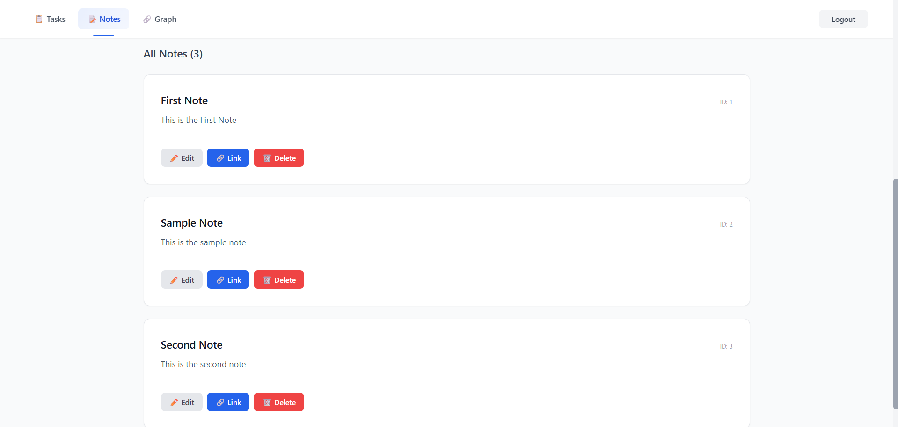
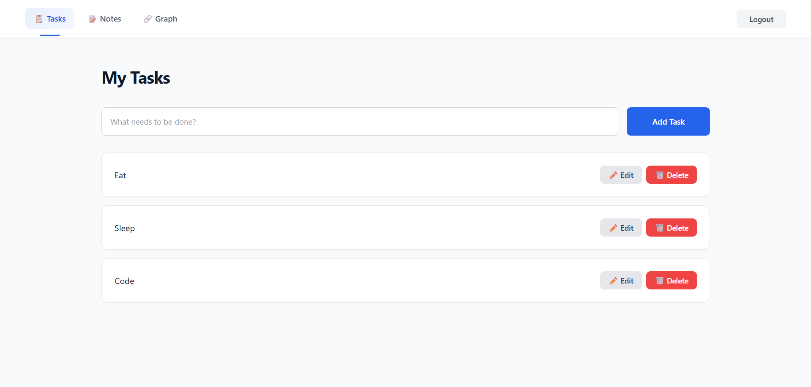
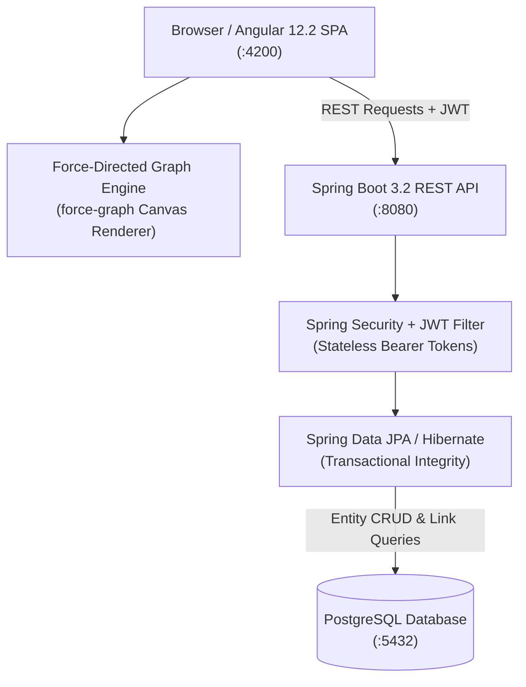

<div align="center">

# SecondBrain

**Knowledge Graph and Connected Thought Productivity Platform**

<p align="center">
  <a href="https://adoptium.net/"></a>
  <a href="https://spring.io/projects/spring-boot"></a>
  <a href="https://angular.dev/"></a>
  <a href="https://github.com/vasturiano/force-graph"></a>
  <a href="https://www.postgresql.org/"></a>
  <a href="LICENSE"></a>
  <a href="#installation-and-setup"></a>
</p>

<p align="center">
  A full-stack personal knowledge management platform mapping thoughts into an interactive graph.<br>
  Connected notes · Bi-directional backlink discovery · Frictionless task lifecycle.
</p>

<p align="center">
  <a href="#quick-flow">Quick Flow</a> •
  <a href="#visual-showcase">Visual Showcase</a> •
  <a href="#system-architecture">Architecture</a> •
  <a href="#core-architectural-modules">Core Modules</a> •
  <a href="#installation-and-setup">Setup</a> •
  <a href="#api-reference">API Reference</a>
</p>

</div>

---

> [!NOTE]
> **Evolutionary Project: The Foundational Knowledge Engine**
> This repository is the foundational **secondBrain** platform, featuring an interactive force-directed knowledge graph and bi-directional note linking.
> If you are looking for the AI-augmented edition with **Google Gemini RAG** and vector embeddings, visit **[Smart-SecondBrain](https://github.com/tanmayythakare/Smart-SecondBrain)**. For a lightweight, zero-AI variant, check out **[lifeos](https://github.com/tanmayythakare/lifeos)**.

---

## Quick Flow

```
JWT Auth  →  Create Notes & Tasks  →  Bi-Directional Linking  →  Force-Directed Graph  →  Backlink Discovery
```

---

## Visual Showcase

| Interactive Knowledge Graph | Note Workspace and Content Editor |
| :---: | :---: |
|  |  |
| **Connected Note Details and Backlinks** | **Personal Task Board** |
|  |  |

---

## System Architecture



---

## Overview

SecondBrain is an interconnected personal productivity system designed to break down the silos between notes and tasks. Rather than keeping thoughts in isolated lists, SecondBrain treats every note as a node in an interconnected web of thoughts, allowing you to discover organic relationships between ideas.

### Problem and Solution
1. **Isolated Thought Silos**: Standard note apps bury ideas in nested folders. SecondBrain links notes bi-directionally so related topics surface naturally.
2. **Visual Idea Navigation**: An interactive force-directed graph gives you a topological bird's-eye view of your entire knowledge base.
3. **Integrated Action Items**: Tasks exist alongside your notes, providing single-pane personal workflow management.

---

## Core Architectural Modules

### 01. Bi-Directional Note Linking and Backlink Resolution
* **Explicit Graph Relationships**: Link any note to another with source and target associations.
* **Automated Backlink Discovery**: When reading a note, all other notes that reference it are automatically retrieved and surfaced.
* **Full-Text Content Search**: Instant parameterized filtering across titles and note bodies.

### 02. Interactive Force-Directed Knowledge Graph
* **Canvas-Rendered Topological Graph**: Powered by `force-graph`, rendering real-time physics-based node clustering based on relationship density.
* **Interactive Navigation**: Drag, zoom, and select nodes to highlight neighbor connections and jump directly into note edit workspaces.

### 03. High-Throughput Task Lifecycle
* **Task State Progression**: Manage action items with inline status toggling (`TODO` ➔ `IN_PROGRESS` ➔ `DONE`).
* **Confirmation-Guarded Actions**: Transactional task creation and deletion preventing accidental loss.

### 04. Multi-Tenant Security and Isolation
* **Stateless JWT Security**: BCrypt password encryption with secure token verification on all protected endpoints.
* **Strict User Tenancy**: Every query isolates entities by authenticated user identifier; no user can see or traverse another user's knowledge graph.

---

## Tech Stack

### Backend
| Technology | Version | Purpose |
| :--- | :--- | :--- |
| **Java** | 17 LTS | Programming language |
| **Spring Boot** | 3.2.x | Backend application framework |
| **Spring Security** | 6.x | Stateless JWT authentication & endpoint authorization |
| **Spring Data JPA** | 3.x | Hibernate Object-Relational Mapping |
| **PostgreSQL** | 14+ | Primary relational datastore |
| **SpringDoc OpenAPI** | 2.3.0 | Swagger UI interactive API contracts |
| **JJWT** | 0.11.5 | Token encoding and parsing |
| **Maven** | 3.x | Build and dependency automation |

### Frontend
| Technology | Version | Purpose |
| :--- | :--- | :--- |
| **Angular** | 12.2 | Single Page Application framework |
| **TypeScript** | 4.3 | Type-safe client development |
| **force-graph** | 1.51 | Interactive HTML5 Canvas graph visualizer |
| **RxJS** | 6.6 | Reactive state and HTTP event streams |
| **CSS3** | — | Custom dark and light theme styles |

---

## Prerequisites

Ensure the following tools are available locally:

* [Java 17 JDK](https://adoptium.net/) or higher
* [Node.js 18+](https://nodejs.org/) (includes `npm`)
* [PostgreSQL 14+](https://www.postgresql.org/download/)
* [Git](https://git-scm.com/)

---

## Installation and Setup

### 1. Clone the Repository
```bash
git clone https://github.com/tanmayythakare/secondBrain.git
cd secondBrain
```

### 2. Set Up Database
Open PostgreSQL and initialize the database:
```sql
CREATE DATABASE secondbrain_db;
CREATE USER secondbrain_user WITH PASSWORD 'secondbrain_pass';
GRANT ALL PRIVILEGES ON DATABASE secondbrain_db TO secondbrain_user;
```

### 3. Configure Backend
Set environment variables or edit `backend/src/main/resources/application.properties`:
```properties
spring.datasource.url=jdbc:postgresql://localhost:5432/secondbrain_db
spring.datasource.username=secondbrain_user
spring.datasource.password=secondbrain_pass
jwt.secret=your_super_secret_jwt_key_at_least_32_characters_long
```

### 4. Run Backend
```bash
cd backend
mvn spring-boot:run
```
The backend initializes on **http://localhost:8080**. Interactive Swagger documentation is available at **http://localhost:8080/swagger-ui.html**.

### 5. Run Frontend
In a new terminal window:
```bash
cd frontend/secondbrain-frontend
npm install
npm start
```
The Angular application starts on **http://localhost:4200**.

---

## API Reference

All protected endpoints require an `Authorization: Bearer <token>` header:

| Method | Endpoint | Description | Auth Required |
| :--- | :--- | :--- | :---: |
| `POST` | `/api/auth/register` | Register new user account | No |
| `POST` | `/api/auth/login` | Authenticate and obtain JWT token | No |
| `GET` | `/api/tasks` | Retrieve tasks for authenticated user | Yes |
| `POST` | `/api/tasks` | Create new task | Yes |
| `PUT` | `/api/tasks/{id}` | Update task details | Yes |
| `DELETE` | `/api/tasks/{id}` | Remove task | Yes |
| `GET` | `/api/notes` | Retrieve user notes | Yes |
| `POST` | `/api/notes` | Create new note | Yes |
| `PUT` | `/api/notes/{id}` | Update note title and content | Yes |
| `DELETE` | `/api/notes/{id}` | Remove note | Yes |
| `GET` | `/api/notes/search?q={query}` | Search notes by keyword | Yes |
| `POST` | `/api/note-links?sourceId=X&targetId=Y` | Create directional link between notes | Yes |
| `GET` | `/api/note-links/{noteId}` | Fetch outgoing linked notes | Yes |
| `GET` | `/api/note-links/backlinks/{noteId}` | Fetch inbound backlinks for note | Yes |

---

## Repository Structure

```
secondBrain/
├── backend/                      # Spring Boot 3.2 REST API (Java 17)
│   ├── src/main/java/            # Controllers, Services, Entities, Repositories
│   ├── src/main/resources/       # application.properties & SQL migrations
│   └── pom.xml                   # Maven dependencies
├── frontend/                     # Angular Single-Page Application
│   └── secondbrain-frontend/     # Angular 12 source files
│       ├── src/app/              # Auth, Tasks, Notes & Knowledge Graph features
│       └── package.json          # Frontend dependencies (force-graph)
└── docs/
    └── screenshots/              # System UI captures and graph visualizations
```

---

## Contributing

1. Fork the repository.
2. Clone your fork:
   ```bash
   git clone https://github.com/tanmayythakare/secondBrain.git
   ```
3. Create your feature branch:
   ```bash
   git checkout -b feat/your-feature-name
   ```
4. Commit your changes:
   ```bash
   git commit -m "feat: add descriptive feature summary"
   ```
5. Push to your branch and submit a Pull Request.

---

## License

This project is open-source and distributed under the **[MIT License](LICENSE)**.

---

## Author

**Tanmay Thakare**
* GitHub: [@tanmayythakare](https://github.com/tanmayythakare)
* Email: [tanmayrthakare@gmail.com](mailto:tanmayrthakare@gmail.com)
* LinkedIn: [Tanmay Thakare](https://www.linkedin.com/in/tanmaythakare)

---

<div align="center">
  <a href="https://github.com/tanmayythakare">
    
  </a>
</div>
